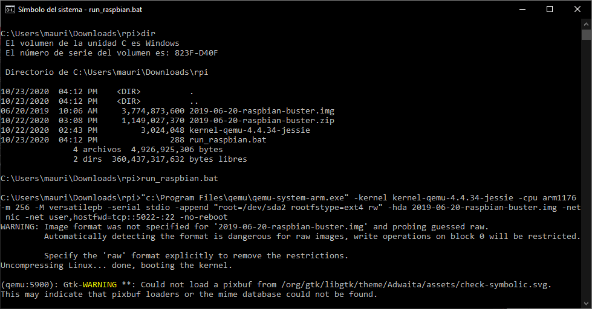
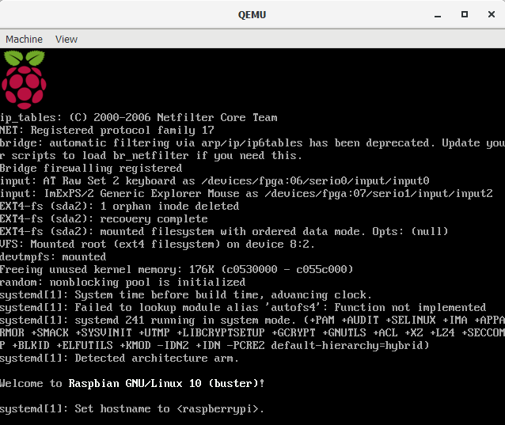
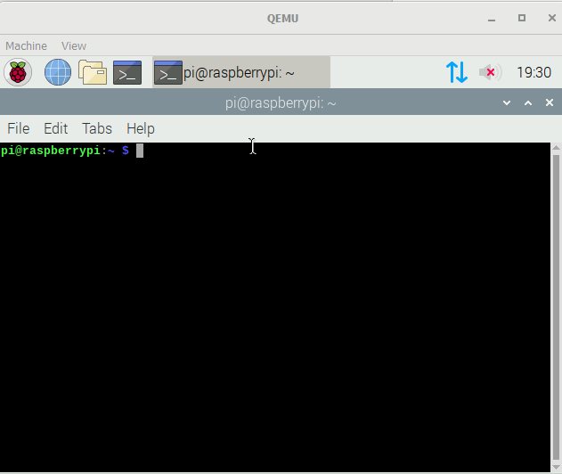
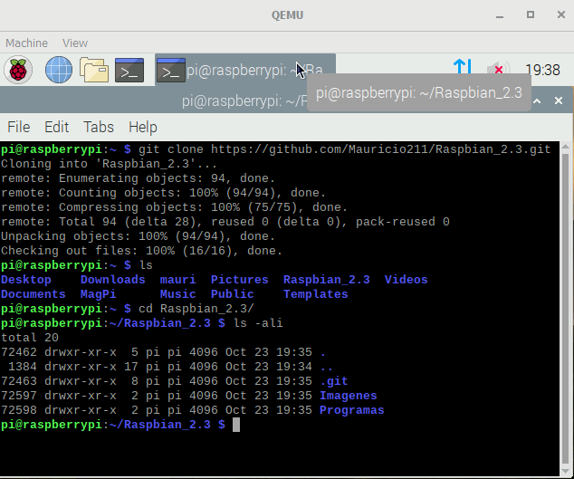
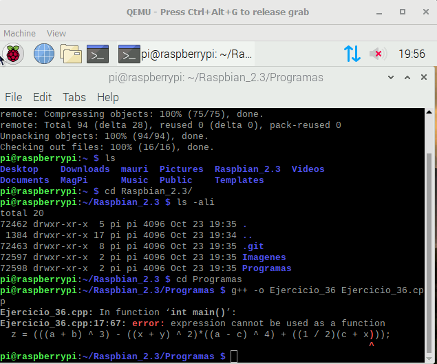
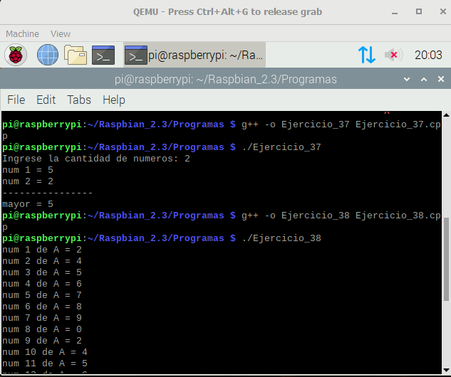
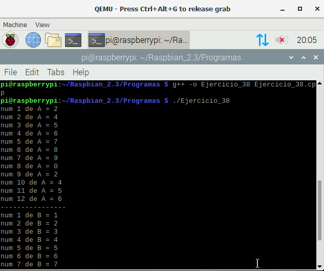
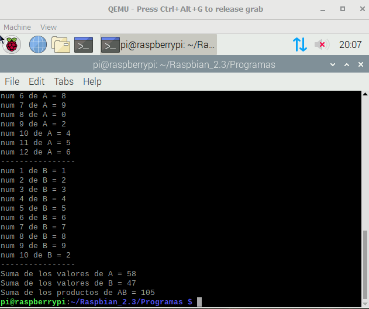
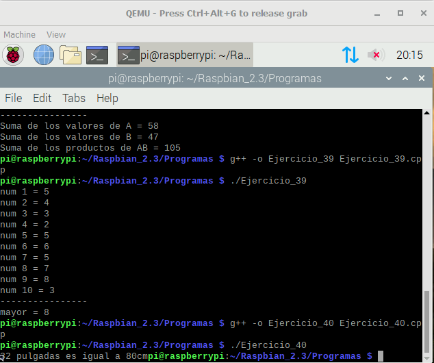
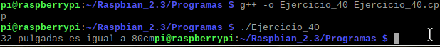

#    Tecnológico Nacional de México
#   Instituto Tecnológico de Tijuana
#        Subdirección Académica

# Departamento de Sistemas y Computación
# Ingeniería en Sistemas Computacionales
# Lenguajes de interfaz 

# Practica Bloque: 2.3  (REPOST) Elabora la QEMU de RaspberryPI virtual y corra sus programas de CPP.

# Chavez Arroyo Mauricio
# No.Control: 18212159
   
# Profesor:
# MC. René Solis Reyes
# Semestre sep - ene 2020


__Ejecucion del archivo run_raspbian.bat en la consola .__



__Pantalla de carga de QEMU .__



__Pantalla principal dentro de QEMU .__


__Consola de comandos de QEMU .__



__Clonacion del repositorio de github en QEMU .__




```bash 
/*
INSTITUTO TECNOLOGICO DE TIJUANA
CHAVEZ ARROYO MAURICIO
NO.CONTROL: 18212159
*/
/*36.-Calcular z de acuerdo con la formula siguiente.
Asignar las variables numericas aprobadas.
Sean a = 4, b = 6, x = 8, y = 2, c = 5 cuando
corra su programa.
*/

#include <iostream>
using namespace std;
int a = 4, b = 6, x = 8, y = 2, c = 5,z;
int main()
{
	z = (((a + b) ^ 3) - ((x + y) ^ 2)*((a - c) ^ 4) + ((1 / 2)(c + x)));
	cout << "Z es igual a=" << z;
}

```



```bash 
/*
INSTITUTO TECNOLOGICO DE TIJUANA
CHAVEZ ARROYO MAURICIO
NO.CONTROL: 18212159
*/
/*
37.-Encontrar el mayor numero entre N numeros no nulos.
Su programa calculara N,contando el numero de valores no nulos
que precede a un cero final.
*/

#include <iostream>
using namespace std;
int main() 
{
	int cantidad(0);
	int numero(0);
	int menor(0);
	int mayor(0);
	float suma(0.0f);
	cout << "Ingrese la cantidad de numeros: ";
	cin >> cantidad;
	for (int cont(1); cont <= cantidad; ++cont) {
		cout << "num " << cont << " = ";
		cin >> numero;
		if (cont == 1) {
			menor = numero;
			mayor = numero;
		}
		else if (numero < menor) {
			menor = numero;
		}
		else if (numero > mayor) {
			mayor = numero;
		}
		suma += numero;
	}
	cout << "----------------\n"
		<< "mayor = " << mayor << endl;
	return 0;	
}

```



```bash 
/*
INSTITUTO TECNOLOGICO DE TIJUANA
CHAVEZ ARROYO MAURICIO
NO.CONTROL: 18212159
*/
/*
38.-Introducir 12 valores de A y 10 de B.Calcular la suma de 
los valores A, la de los B,y la suma de los productos AB.
*/

#include <iostream>
using namespace std;
int main()
{
	int A(12);
	int B(10);
	int numeroA(0);
	int numeroB(0);
	float sumaA(0.0f);
	float sumaB(0.0f);
	float AB(0.0f);
	for (int contA(1); contA <= A; ++contA)
	{
		cout << "num " << contA << " de A = ";
		cin >> numeroA;
		
		sumaA += numeroA;
	}
	cout << "----------------\n";
	for (int contB(1); contB <= B; ++contB)
	{
		cout << "num " << contB << " de B = ";
		cin >> numeroB;
		sumaB += numeroB;
	}
	AB = sumaA + sumaB;
	cout << "----------------\n"
		<< "Suma de los valores de A = " << sumaA << endl
	    << "Suma de los valores de B = " << sumaB << endl
		<< "Suma de los productos de AB = " << AB << endl;
	return 0;
}

```





```bash 
/*
INSTITUTO TECNOLOGICO DE TIJUANA
CHAVEZ ARROYO MAURICIO
NO.CONTROL: 18212159
*/
/*
39.-Dados diez enteros, imprimir solo el mayor.
No suponer que los numeros estan enlistados en los datos de
una orden especial.Puede suponerse que no hay dos numeros iguales.
*/

#include <iostream>
using namespace std;
int main() 
{
	int cantidad(10);
	int numero(0);
	int menor(0);
	int mayor(0);
	float suma(0.0f);
	for (int cont(1); cont <= cantidad; ++cont) {
		cout << "num " << cont << " = ";
		cin >> numero;
		if (cont == 1) {
			menor = numero;
			mayor = numero;
		}
		else if (numero < menor) {
			menor = numero;
		}
		else if (numero > mayor) {
			mayor = numero;
		}
		suma += numero;
	}
	cout << "----------------\n"
		<< "mayor = " << mayor << endl;
	return 0;	
}

```



```bash 
/*
INSTITUTO TECNOLOGICO DE TIJUANA
CHAVEZ ARROYO MAURICIO
NO.CONTROL: 18212159
*/
/*
40.-Una pulgada equivale a 2.5cm.,calcular el numero de cm en 32 pulgadas.
*/

#include <iostream>
using namespace std;
double cm,in=32;
int main()
{
	cm = in * 2.5;
	cout << "32 pulgadas es igual a " << cm;
	printf("cm");
}

```


 

## Esta practica fue dificil para mi por no tener tanto conocimiento sobre el sistema operativo,pero despues de unos cuantos ejemplos logre hacer todo lo requerido exceptuando por el primer programa que no me corrio en el QEMU,pero sin contar eso todo estuvo bien aunque un poco tardado.

<a href="http://cooltext.com" target="_top"></a>

